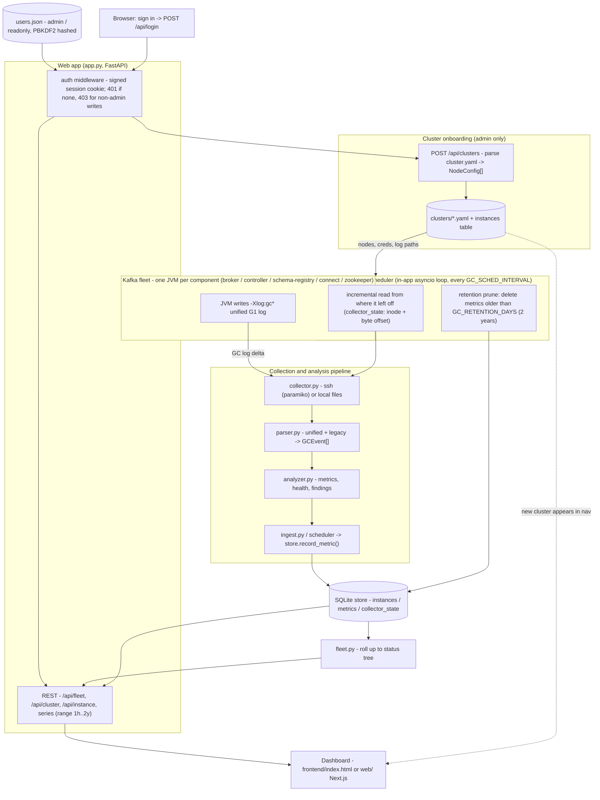

# BSP Kafka GC Analyzer

A self-hosted web app that analyzes JVM garbage-collection behavior across a
**multi-region Kafka fleet** and renders it as a navigable, color-coded
dashboard. It answers, at a glance: *what's healthy right now, what broke in the
last hour, and how has each component trended over the last month?*

Navigation hierarchy:

```
Region (DEMO — extensible to NAM · EMEA · APAC in production)
  └─ Environment (KRAFT · ZOOKEEPER)
       └─ Cluster (DEMO-KRAFT or DEMO-ZK)
            └─ Component group (Brokers · Schema Registry · Kafka Connect ·
                               Controllers/KRaft *or* ZooKeeper)
                 └─ Instance (a single JVM, e.g. DEMO-KRAFT-broker-2)
```

Analysis depth is inspired by [gceasy.io](https://gceasy.io/) (throughput, pause
percentiles, Full-GC detection, heap occupancy, tuning advice) but runs
**entirely on your own infrastructure** — no logs leave your network, no API key.

---

## Two ways to run the UI

There are two interchangeable frontends over the **same FastAPI backend**:

1. **Next.js app** (`web/`) — the primary UI: a TypeScript App-Router app.
   Clicking the **BSP Kafka GC Analyzer** title returns to the fleet overview;
   clusters and instances are real routes (`/cluster/DEMO-KRAFT`,
   `/instance/DEMO-KRAFT-broker-2`).
2. **Single-file dashboard** (`frontend/index.html`) — the same dashboard with
   no build step; also used to produce the standalone `dashboard-preview.html`.

### Quick start — backend + Next.js app

```bash
cd kafka-gc-analyzer
pip install -r requirements.txt
python -m seed.seed_history          # builds 30 days of demo history -> gc_history.db
python -m gcanalyzer.app             # FastAPI backend on http://127.0.0.1:8000

# in a second terminal:
cd web
npm install
npm run build && npm start           # Next.js UI on http://127.0.0.1:3000
#   (dev mode: npm run dev)
```

The Next.js app proxies `/api/*` to the backend, so the browser stays
same-origin (no CORS). Point it elsewhere with `BACKEND_URL=http://host:8000`.

### Quick start — no build (single-file UI)

```bash
python -m seed.seed_history
python -m gcanalyzer.app             # then open http://127.0.0.1:8000
# or just: ./run.sh
```

Want to look without running anything? Open **`dashboard-preview.html`** — a
fully standalone snapshot of the demo fleet (20 JVMs, 2 clusters — KRaft + ZooKeeper,
30-day trends, live "last hour" alerts) inlined into one file. Regenerate with
`python export_static.py`.

---

## What the dashboard shows

**Left tree** — Region → Environment → Cluster → Component → Instance, each with
a status dot (🟢 healthy · 🟡 watch · 🔴 critical · ⚪ no data). Paths containing
problems auto-expand; a 🔴 marker flags any instance with a Full GC in the last
hour.

**Fleet overview (home)** — counts of healthy / watch / critical components and
a list of **"Issues in the last hour"**, color-coded by severity. Click any alert
to jump straight to the offending component.

**Cluster overview (click a cluster in the nav)** — one picture for a single
cluster (e.g. DEMO-KRAFT): how many nodes are healthy vs unhealthy, aggregate
cluster memory (live set vs total heap), and Java/GC configuration & telemetry
(GC engine, log format, pause target, avg throughput, Full GCs in the last
1h/24h, worst pause, heap sizing by role). Below that, every node as a
color-coded card, and a **"Needs attention"** section listing only the unhealthy
ones — click any of them to drill into that node and investigate.

**Instance view (click a broker / any component)**
- Current health grade (A–F) + score and the reasons behind it.
- Any active last-hour alerts.
- Current 24h metrics: throughput, time-in-GC, pause avg/p99/max, GC frequency,
  Full GCs, heap max, avg/peak live set, promotion trend.
- **30-day trend charts**: heap live set vs `-Xmx`, heap utilization %, GC pause
  trend (p99 & max), and Full GCs per day with time-in-GC overlay.
- Pros / Cons / How-to-improve — Kafka-aware tuning recommendations.

### "Last hour" alert triggers (color coding)

| Trigger | Severity | Default |
|---|---|---|
| Any Full GC | 🔴 critical | > 0 in last hour |
| Long stop-the-world pause | 🔴 critical | max pause > 500 ms |
| Heap pressure | 🟡 warning | post-GC live set > 85% |
| GC storm / throughput drop | 🟡 warning | time-in-GC > 3× the node's own 30-day baseline (min 5%) |

Thresholds live at the top of `gcanalyzer/store.py`.

---

## How it works with a real fleet

1. **Inventory** — `gcanalyzer/topology.py` defines regions, environments,
   clusters and component instances. Replace it with your real inventory (or
   load from config / service discovery).
2. **Collection** — `gcanalyzer/collector.py` pulls each node's GC log over SSH
   (paramiko) from the Kafka/ZooKeeper default log locations (override per node).
3. **Parse** — `gcanalyzer/parser.py` parses Java 11+ unified `-Xlog:gc*` G1 logs
   (and recognizes ZGC/Shenandoah/Parallel/CMS/Serial + legacy Java 8).
4. **Persist** — a periodic job calls `store.record_metric()` to append hourly
   rollups to SQLite (`gc_history.db`). That history is what powers 30-day trends
   and last-hour alerting. (`seed/seed_history.py` fakes this for the demo.)
5. **Serve** — `gcanalyzer/app.py` (FastAPI) exposes the fleet rollup, per-instance
   snapshots, and trends; `frontend/index.html` renders the dashboard.

Enable GC logging on your nodes (Java 11+):

```
-Xlog:gc*:file=/opt/kafka/logs/kafkaServer-gc.log:time,uptime,level,tags:filecount=10,filesize=50M
```

### REST API

| Method | Path | Returns |
|---|---|---|
| GET | `/api/fleet` | Topology tree with rollup health + last-hour alerts |
| GET | `/api/cluster/{cluster}` | One-cluster overview: counts, memory, config telemetry, nodes, attention list |
| GET | `/api/instance/{id}` | Current snapshot: health, alerts, metrics, findings |
| GET | `/api/instance/{id}/trends?days=30` | Daily-aggregated trend series |
| GET | `/api/instance/{id}/recent?hours=48` | Fine-grained recent series |
| GET | `/api/health` | Liveness probe |

---

## Architecture

```
gcanalyzer/
  topology.py   Region/env/cluster/component inventory model
  parser.py     Unified (Java 11+) + legacy GC log parser; collector detection
  analyzer.py   Metrics, percentiles, health score, tuning recommendations
  collector.py  SSH (paramiko) + local-file GC-log collection
  store.py      SQLite time-series store; trends, current health, last-hour alerts
  fleet.py      Rollup of inventory + history into the navigable status tree
  app.py        FastAPI: REST API + serves the dashboard
frontend/
  index.html    Single-page fleet dashboard (Chart.js from CDN)
web/            Next.js app (App Router, TypeScript) — primary UI over the API
  app/          routes: / (fleet), /cluster/[cluster], /instance/[id]
  components/   Header (clickable title -> home), Sidebar tree, Fleet/Cluster/Instance views, TrendCharts
  lib/          api client, types, fleet context
  next.config.js   proxies /api/* to BACKEND_URL (default :8000)
seed/
  seed_history.py   30 days of synthetic hourly metrics + injected incidents
samples/        Synthetic raw GC logs + generator (for the parser path)
tests/          test_pipeline.py (parser/analyzer) · test_fleet.py (store/rollup)
export_static.py  Render a standalone, serverless dashboard snapshot
```

New files: live path — `gcanalyzer/ingest.py` (collect->parse->analyze->record_metric
bridge), `docker-compose.live.yml`, `cluster.live.yaml`; auth — `gcanalyzer/auth.py`,
`gcanalyzer/users.py`; re-collection — `gcanalyzer/scheduler.py`.

### Detailed data-flow architecture



How the loop runs end to end:

- **Onboard** (admin): paste a `cluster.yaml` -> `POST /api/clusters` registers the
  nodes and persists `clusters/<cluster>.yaml`.
- **Collect** (scheduler, every interval): for each onboarded cluster, read each GC
  log *from its saved offset*, parse only the new events, `record_metric()` one
  point, then prune anything past the 2-year retention window.
- **Auth**: every `/api/*` needs a valid session cookie; `admin` adds/removes/modifies
  clusters, `readonly` can only view. Manage accounts with `python -m gcanalyzer.users`.
- **View**: the dashboard reads rollups + per-instance series from SQLite, with a
  selectable time range (1h, 3h, 6h, 12h, 24h, 2d, 7d, 30d, 90d, 1y, 2y).

---

## Tests

```bash
python -m tests.test_pipeline      # 7 checks: parsing + analysis
python -m tests.test_fleet         # 7 checks: inventory, trends, alerting, rollup
```

The fleet tests seed a temp DB and confirm, among other things, that DEMO-KRAFT
carries all five environments, that an injected Full-GC storm raises a critical
last-hour alert while a 26-hour-old incident does **not**, and that a region rolls
up to `critical` when one component is failing.

---

## Notes & scope

- Tuned for **Java 11+ unified logging with G1** (the modern Kafka default).
- The demo fleet (20 JVMs, 2 clusters: KRaft + ZooKeeper) is generated for illustration; swap
  in your real inventory + a collection job to make trends accumulate from
  production.
- Read-only: it never restarts JVMs or changes flags. Recommendations are
  advisory — validate in a lower environment first.
- SQLite is used for the history store; for a large fleet with long retention you
  can point `store` at Postgres/Timescale with minimal changes (the query layer
  is small and isolated).
```
