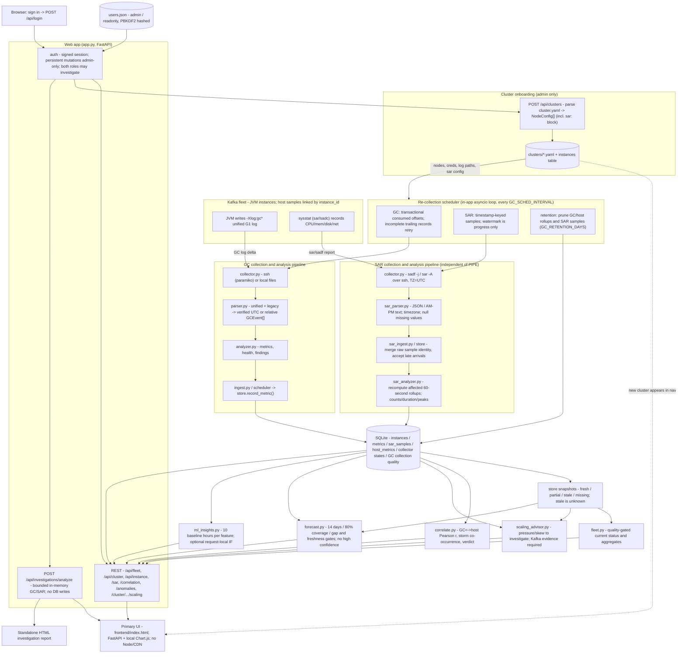

# BSP Kafka GC Analyzer

A self-hosted web app that analyzes JVM garbage-collection behavior across a
**multi-region Kafka fleet** and renders it as a navigable, color-coded
dashboard. It answers, at a glance: *what's healthy right now, what broke in the
last hour, and how has each component trended over the last month?*

It also collects **OS-level server health (CPU, memory, disk, network) via SAR**
from configured hosts and compares it with GC pressure. Cluster advice identifies
resource pressure and cross-broker skew to **investigate**, not a scaling or
partition-rebalance prescription. Kafka workload, latency, replication, and
partition-placement evidence is required before deciding on a capacity change.
See [Server health (SAR), GC correlation & scaling advisor](#server-health-sar-gc-correlation--scaling-advisor) below.

Navigation hierarchy:

```
Region (DEMO — extensible to NAM · EMEA · APAC in production)
  └─ Environment (KRAFT · ZOOKEEPER)
       └─ Cluster (DEMO-KRAFT or DEMO-ZK)
            └─ Component group (Brokers · Schema Registry · Kafka Connect ·
                               Controllers/KRaft *or* ZooKeeper)
                 └─ Instance (a single JVM, e.g. DEMO-KRAFT--broker-2)
```

Analysis depth is inspired by [gceasy.io](https://gceasy.io/) (throughput, pause
percentiles, Full-GC detection, heap occupancy, tuning advice) but runs
**entirely on your own infrastructure** — no logs leave your network, no API key.

---

## Running The App

Use `manage-app.sh` as the single control surface for local setup, deployment,
startup, shutdown, status, and logs:

```bash
./manage-app.sh deploy 8083        # install dependencies, then restart (connected setup)
./manage-app.sh start 8083 --open  # start in the background and open the dashboard
./manage-app.sh status 8083
./manage-app.sh logs 8083
./manage-app.sh restart 8083
./manage-app.sh stop 8083
```

Useful overrides:

```bash
GC_HOST=0.0.0.0 ./manage-app.sh start 8083
GC_DB=gc_live.db ./manage-app.sh deploy 8083
PYTHON=python3.14 ./manage-app.sh setup
```

The legacy `run.sh` and macOS `start-local.command` entrypoints are still
present, but they now delegate to `manage-app.sh`.

The supported dashboard is **`frontend/index.html`**, served by FastAPI on the
same port as the API. It needs **no Node.js, npm, frontend build, or CDN access**.
Chart.js is included locally with its license. `web/` remains an optional legacy
Next.js frontend; it is not the target of the current dashboard improvements.

`start` and `restart` use installed dependencies without contacting package
repositories. They do not create demo data. Use `setup` or `deploy` only when
installing dependencies is intended; use the approved offline installer on an
air-gapped server. An empty database opens an empty fleet ready for onboarding.

Demo data is explicit and should use a separate database:

```bash
./manage-app.sh seed gc_demo.db
GC_DB=gc_demo.db .venv/bin/python -m seed.seed_sar_history
GC_DEMO_MODE=1 GC_SCHED_ENABLED=0 ./manage-app.sh start 8084 gc_demo.db
```

Live views use the current clock. `GC_DEMO_MODE=1` instead anchors views to the
newest GC, SAR, or collection-quality record for a frozen demo. Do not enable it for live monitoring.
Set `GC_CONFIG_DIR` to override the cluster configuration directory.

### Optional Legacy Next.js Frontend

The following is only for the legacy `web/` client. It requires Node.js and does
not provide the supported static dashboard's current quality/investigation UI.
The separate demo database and demo clock are explicit:

```bash
cd kafka-gc-analyzer
pip install -r requirements.txt
GC_DB=gc_demo.db python -m seed.seed_history
GC_DB=gc_demo.db python -m seed.seed_sar_history
GC_DB=gc_demo.db GC_DEMO_MODE=1 GC_SCHED_ENABLED=0 python -m gcanalyzer.app  # backend :8000

# in a second terminal:
cd web
npm install
npm run build && npm start           # Next.js UI on http://127.0.0.1:3000
#   (dev mode: npm run dev)
```

The Next.js app proxies `/api/*` to the backend, so the browser stays
same-origin (no CORS). Point it elsewhere with `BACKEND_URL=http://host:8000`.

### Quick Start — No Build

```bash
./manage-app.sh setup             # once, with repository access
./manage-app.sh start 8083 --open
```

Want to look without running anything? Open **`dashboard-preview.html`** — a
fully standalone snapshot of the demo fleet (20 JVMs, 2 clusters — KRaft + ZooKeeper,
30-day trends, captured "last hour" alerts) inlined into one file. This is a
historical export, not a live monitor. Regenerate from a separate seeded database
with `GC_DB=gc_demo.db GC_DEMO_MODE=1 python export_static.py`.

---

## What the dashboard shows

**Left tree** — Region → Environment → Cluster → Component → Instance, each with
a status dot (🟢 healthy · 🟡 watch · 🔴 critical · ⚪ no data). Paths containing
problems auto-expand; a 🔴 marker flags any instance with a Full GC in the last
hour.

**Fleet overview (home)** — counts of healthy / watch / critical components and
a list of **"Issues in the last hour"**, color-coded by severity. Click any alert
to jump straight to the offending component.

**Cluster overview (click a cluster in the nav)** — one picture for a single
cluster (e.g. DEMO-KRAFT): how many nodes are healthy vs unhealthy, aggregate
cluster memory (live set vs total heap), and Java/GC configuration & telemetry
(GC engine, log format, pause target, avg throughput, Full GCs in the last
1h/24h, worst pause, heap sizing by role). Below that, every node as a
sortable comparison row, and a **"Needs attention"** section listing only the unhealthy
ones — click any of them to drill into that node and investigate.

**Instance view (click a broker / any component)**
- Current health grade (A–F) + score when evidence is usable; otherwise `?` with quality details.
- Any active last-hour alerts.
- Current 24h metrics: throughput, time-in-GC, pause avg/p99/max, GC frequency,
  Full GCs, heap max, avg/peak live set, promotion trend.
- **30-day trend charts**: heap live set vs `-Xmx`, heap utilization %, GC pause
  trend (p99 & max), and Full GCs per day with time-in-GC overlay.
- Pros / Cons / How-to-improve — Kafka-aware tuning recommendations.
- **Server health (SAR)**: A–F or unknown/partial health for the *host* underneath
  this JVM — CPU/iowait, memory/swap, disk, network — with its own trend
  charts and pros/cons/recommendations.
- **GC ↔ host correlation**: is this node's GC pressure a JVM tuning question
  or a host-resource one? Verdict, correlated signal pairs, and a "storm
  co-occurrence" read.

**Cluster view also shows a Capacity & scaling panel** with evidence quality,
cross-node skew, a per-broker pressure table, and an `investigate` verdict when
pressure needs follow-up. Missing or stale sources cannot establish healthy
capacity, and these metrics alone do not justify a scaling prescription. See
[Server health (SAR), GC correlation & scaling advisor](#server-health-sar-gc-correlation--scaling-advisor)
for the full picture.

**Health grade legend** — A = healthy (`90-100`), B = good (`75-89`),
C = watch (`60-74`), D = at risk (`40-59`), and F = critical (`0-39`).
The score starts at `100` and subtracts risk points for low throughput, long
stop-the-world pauses, Full GCs, and high post-GC heap pressure. Host health
uses the same A–F scale, scored against CPU/iowait/memory/swap/disk/network
thresholds instead.

**Unknown is not healthy.** `?` means there is not enough usable current data.
Missing values display as unavailable, not zero. Source-quality labels distinguish
fresh, partial, stale, and missing GC/SAR observations. Historical charts can
remain available even when the current health is unknown. Snapshot `quality`
contains `state`, `last_observed_at`, `age_seconds`, `available_metrics`, and
`missing_metrics`. Missing/stale snapshots retain `latest` for historical display
but return empty current metrics/advice and health `{grade: "?", status: "unknown",
score: null}`. Freshness defaults to two hours, configurable with
`GC_SOURCE_MAX_AGE_S` and `SAR_SOURCE_MAX_AGE_S`. Explicit `now` remains supported
for historical queries; implicit LIVE time uses wall clock, not the newest row.

GC collection quality is recorded separately from measured metrics. A batch
containing only malformed or unsupported complete records marks current health
unknown without inventing zero-valued observations. Confirmed recent GC alerts
remain visible; a later usable collection can restore current health.

The header theme toggle retains light/dark presentation and remembers the choice
locally; neither theme changes grading or source-quality rules.

### One-Time Log Investigations

Choose **Analyze logs**. Upload GC text logs or `.gz` files, optionally alongside
a SAR JSON/text export from the same host. Select **Files are rotations from the
same JVM** only for files from one JVM; otherwise each file is analyzed separately.
Host comparison requires one JVM group and overlapping timestamps.

Uptime-only GC records stay relative unless you supply a verified JVM start time
including its timezone. Export SAR in UTC (`TZ=UTC LC_ALL=C sadf -j -- -A`);
binary `saXX` files are not accepted directly. Optional `report_date` anchors a SAR
text report, not a JVM start time. The editable SAR timezone is `report_timezone`,
defaulting to `UTC`; use the report's IANA timezone, such as `America/Toronto`, for
local-time exports. Embedded SAR JSON UTC/offset information takes precedence.
Ambiguous or nonexistent daylight-saving wall times are rejected, not guessed.

Limits: 12 GC files, 4 MiB per expanded file, 8 MiB expanded total including SAR,
12 MiB request body, and two concurrent investigations per app process. Existing
admin and read-only users can call `POST /api/investigations/analyze`. Uploads are
processed in memory with **no database writes** and are **not added to fleet
history or learning baselines**. Download an HTML report
for the investigation. Diagnostic wording uses **What we found / Why it matters /
Next step**; association is not proof of a cause or Kafka service impact.

### Prometheus Settings

Sign in as an **admin**, open **Settings → Prometheus**, update the server base
URL, and choose **Save settings**, then **Test connection**. HTTP and HTTPS
connections without authentication are supported. The test checks the saved
configuration only; edits must be saved first. A successful test confirms the
query API responds, **not that Kafka metrics are available**. Its timestamp is
the last test, not continuous connection monitoring; restarting the app clears it.

Settings are stored in **`prometheus.json` at the project root**, outside Git.
The screen displays the absolute path. Set `GC_PROMETHEUS_CONFIG` to an absolute
path, such as `/etc/gcanalyzer/prometheus.json`, to use another location (restart
after changing this environment variable). The parent directory must exist and
be writable by the app user. Saves are atomic with file permissions `0600`.
You can also edit valid JSON directly and reload Settings; no app restart is
needed for content changes. See [prometheus.example.json](prometheus.example.json)
for the schema. Internal endpoint and target names are not in the example.

The saved selection retains raw `job`, `region`, `tier`, `infra`, `az`, `service`,
and full `instance` (hostname plus exporter port) values. Empty lists mean no
selection restriction. Defaults include `dev`, `uat`, `prod`, `sandbox`, `stage`,
EMEA/AMER/APAC, and `icp`/`phy`. Service aliases map `kafka` to `broker`, `registry`
to `schema-registry`, and preserve `connect` and `zookeeper`. The expected scrape
interval is 60 seconds; changing it here **does not change Prometheus scraping**.

**This release saves settings and tests access only.** It does not collect metrics,
apply these filters to live analysis, or modify the external `prometheus.yml`.
The admin-only endpoints are `GET`/`PUT /api/settings/prometheus` and
`POST /api/settings/prometheus/test`. No new Python packages or Node.js runtime
are required for this feature.

The Excel mapping can wait until cluster-specific analysis. A job such as
`bvp-<region>-<env>` can contain **multiple Kafka clusters** and is not a cluster
identifier. Cross-region ZooKeeper tiebreakers are intentional: keep their actual
region labels and verified logical cluster membership, rather than rejecting them
because they differ from the job's region. Keep environment baselines separate;
do not infer cluster membership from a region, AZ, or job name.

**ML Tech Preview** — anomaly scoring over the combined GC+host signal
(`gcanalyzer/ml_insights.py`): dependency-free robust z-score scoring requires
at least **10 observed baseline hours per feature**, plus usable recent evidence.
An optional `IsolationForest` can run when scikit-learn and sufficient complete
feature vectors are available; it is fitted **request-local only**, with no
persistent trained model or continuous learning. Unready features are not scored.
Deterministic GC and host-resource rules remain the source of truth for health
grades and evidence-based investigation guidance; anomalies only flag "worth a human look."
The output identifies the method actually used and baseline readiness. A noise
floor prevents tiny changes in a flat baseline from appearing extreme. Forecasts
are advisory projections, not trained failure predictions; sparse or stale
history withholds predictions. Kafka-native evidence is still needed before
making a capacity or partition-placement decision.

### "Last hour" alert triggers (color coding)

| Trigger | Severity | Default |
|---|---|---|
| Any Full GC | 🔴 critical | > 0 in last hour |
| Long stop-the-world pause | 🔴 critical | max pause > 500 ms |
| Heap pressure | 🟡 warning | post-GC live set > 85% |
| GC storm / throughput drop | 🟡 warning | time-in-GC > 3× the node's own 30-day baseline (min 5%) |

Thresholds live at the top of `gcanalyzer/store.py`.

---

## How it works with a real fleet

1. **Inventory** — onboard cluster YAML through the dashboard. Cluster
   configuration and the `instances` table define the live inventory;
   `gcanalyzer/topology.py` supplies shared types and demo inventory helpers.
2. **Collection** — `gcanalyzer/collector.py` pulls each node's GC log over SSH
   (paramiko) from the Kafka/ZooKeeper default log locations (override per node).
3. **Parse** — `gcanalyzer/parser.py` parses Java 11+ unified `-Xlog:gc*` G1 logs
   (and recognizes ZGC/Shenandoah/Parallel/CMS/Serial + legacy Java 8).
   Uptime-only events stay relative unless a verified JVM start anchor is supplied;
   neither file dates nor collection time are invented as event timestamps.
4. **Persist** — GC metric writes, collection-quality markers, and consumed offsets
   are transactional. Incomplete trailing records keep their offsets retryable;
   complete malformed or unsupported records are reported as skipped/limited
   quality. Missing or unusable-only evidence is unknown, not a refreshed healthy observation.
   Durable malformed-record quarantine is pending. SQLite history powers trends and last-hour
   alerting; synthetic demo history is generated only by explicit seeding.
5. **Collect host metrics** — independently, `gcanalyzer/sar_ingest.py` runs
   `sar`/`sadf` using the configured host access. Samples persist once in
   `sar_samples`; only affected fixed **60-second** `host_metrics` rollups are
   recomputed, under the same instance identity. Repeats and late arrivals are
   idempotent. Demo SAR history remains a separate explicit seed operation.
6. **Correlate & investigate** — `correlate.py` and `scaling_advisor.py` read
   GC/host history on demand, rebucket overlapping evidence, and flag associations
   or cross-node pressure to investigate. Missing and stale sources gate current
   advice. Absence of correlation does not prove a JVM cause.
7. **Serve** — `gcanalyzer/app.py` (FastAPI) exposes the fleet rollup,
   per-instance GC + host snapshots, trends, correlation, and scaling
   guidance; the supported `frontend/index.html` renders the dashboard using
   local static assets. `web/` is an optional legacy client.

Enable GC logging on your nodes (Java 11+):

```
-Xlog:gc*:file=/opt/kafka/logs/kafkaServer-gc.log:time,uptime,level,tags:filecount=10,filesize=50M
```

And `sysstat` for host metrics — see
[Server health (SAR)](#server-health-sar-gc-correlation--scaling-advisor) above.

### REST API

| Method | Path | Returns |
|---|---|---|
| GET | `/api/fleet` | Topology tree with rollup health + last-hour alerts |
| GET | `/api/cluster/{cluster}` | One-cluster overview: counts, memory, config telemetry, nodes, attention list |
| GET | `/api/instance/{id}` | GC snapshot: instance, latest, metrics, health, alerts, findings, quality |
| GET | `/api/instance/{id}/trends?days=30` | Daily-aggregated trend series |
| GET | `/api/instance/{id}/recent?hours=48` | Fine-grained recent series |
| GET | `/api/instance/{id}/series?range=24h` | Selectable-range GC trend series (`1h`..`2y`) |
| GET | `/api/instance/{id}/sar` | Host snapshot: instance, latest, metrics, health, findings, quality |
| GET | `/api/instance/{id}/sar/trends?days=30` | Daily-aggregated host trend series |
| GET | `/api/instance/{id}/sar/series?range=24h` | Selectable-range host trend series |
| GET | `/api/instance/{id}/correlation?days=30` | GC&lt;-&gt;host correlation: verdict, r-values, findings |
| GET | `/api/instance/{id}/anomalies?days=30&recent_hours=24` | ML Tech Preview anomaly score (advisory) |
| GET | `/api/cluster/{cluster}/scaling?role=broker` | Evidence-gated resource pressure/skew investigation guidance |
| GET | `/api/instance/{id}/forecast?days=90&horizon=90` | Capacity forecast: per-signal trend, days-to-breach, risk |
| GET | `/api/cluster/{cluster}/forecast?role=broker` | Advisory trend risks and investigation evidence; no automatic scaling plan |
| POST | `/api/instance/{id}/sar/upload` | (admin) Ingest a pasted `sadf -j` / `sar -A` export — no SSH needed |
| POST | `/api/investigations/analyze` | (admin or readonly) Bounded one-time GC/optional SAR analysis; no database writes |
| GET | `/api/health` | Liveness probe |

---

## Server health (SAR), GC correlation & scaling advisor

Beyond parsing GC logs, the analyzer can SSH into the same Kafka/ZooKeeper
hosts and pull OS-level activity via **sysstat (`sar`/`sadf`)** — CPU, memory,
swap, disk, and network — then line it up against GC pressure to answer a
question GC logs alone can't: *does observed host pressure coincide with this
node's GC pressure?* Cluster comparisons highlight which resources and brokers
need investigation. Scaling direction and partition placement require Kafka-native
evidence that GC and SAR alone do not provide.

### Prerequisite: sysstat

Each Kafka/ZooKeeper host needs the `sysstat` package installed and its
collection cron enabled (it usually is by default on most distros):

```bash
# Debian/Ubuntu
sudo apt-get install -y sysstat
sudo sed -i 's/^ENABLED="false"/ENABLED="true"/' /etc/default/sysstat   # if present
sudo systemctl enable --now sysstat

# RHEL/CentOS/Amazon Linux
sudo yum install -y sysstat
sudo systemctl enable --now sysstat
```

That's it — no agent to deploy. The analyzer reads `sar`/`sadf` output over
the configured SSH host access in a separate collection pass; nothing is installed on the
analyzer side beyond the optional `paramiko` dependency it already needs.

### How collection works

1. **Collect** (`gcanalyzer/collector.py`) — over SSH, runs
   `TZ=UTC LC_ALL=C sadf -j -- -A` (structured JSON, sysstat >= 11.x) and
   falls back to `TZ=UTC LC_ALL=C sar -A` (the classic, extremely stable
   columnar text report every sysstat version can produce — the same format
   tools like [kSar](https://github.com/vlsi/ksar) parse) if `sadf -j` isn't
   available. `TZ=UTC` matters: sar/sadc store samples as UTC internally and
   render them in whatever TZ the *reporting* command runs under, so this
   makes host samples comparable with GC events that have verified absolute
   timestamps. Relative-only GC records cannot be aligned to calendar time.
2. **Parse** (`gcanalyzer/sar_parser.py`) — both formats normalize into the
   same `SarSample` shape (CPU incl. steal, load 1/5/15, run queue, context
   switches, memory incl. available/page-cache/commit%, swap occupancy,
   paging activity from `sar -B` (pgpgin/pgpgout, faults, major faults),
   swapping activity from `sar -W` (pswpin/pswpout), per-disk, per-NIC —
   the full RHEL 8/9 sysstat section set), so the rest of the pipeline
   never needs to know which format the data came from. AM/PM text and ISO or
   slash-format report dates are supported. Missing fields remain `null`, not
   zero; local timestamps require the correct reporting timezone.
3. **Analyze** (`gcanalyzer/sar_analyzer.py`) — rolls samples into the same
   "metrics / health / findings" shape `analyzer.py` produces for GC, so a
   node has an A–F grade only when the required host measurements are available.
   Missing health is unknown; partial host evidence has grade `?`, status
   `partial`, and a null score, while retaining observed pressure findings.
4. **Persist** (`store.py`) — `sar_samples` stores one sparse normalized sample
   per `(instance_id, ts)`, not repeated report blobs. Repeated or late samples
   are idempotent; corrections and complementary fields merge at that identity.
   Only affected fixed **60-second** `host_metrics` buckets are recomputed in the
   same transaction. Counts, duration, per-metric weights, and peaks survive
   rollup/query aggregation; unknown durations use sample weights instead.
   `sar_collector_state` is a progress watermark, never a filter for late data.
   Additive migrations preserve old rows, but old parser-defaulted zeroes and
   discarded peaks cannot be recovered without reimporting the source reports.
5. **Correlate** (`gcanalyzer/correlate.py`) — joins GC and host metrics per
   instance, computes Pearson correlation between GC pressure signals
   (time-in-GC, pause tail, Full GC count) and host signals (CPU busy,
   iowait, memory, swap, disk await, NIC util), and a plain-language
   "storm co-occurrence" read (*of the hours this node was in a GC storm, what
   fraction also showed host pressure?*). Outcomes distinguish observed
   `gc_bound` / `host_bound` / `mixed` pressure from `healthy` and
   `insufficient_data`; correlation is association, not proof of causality.
6. **Investigate** (`gcanalyzer/scaling_advisor.py`) — at the cluster level,
   classifies each broker's dominant bottleneck (CPU / disk / iowait / host
   memory / swap / network / JVM heap / healthy) and measures cross-node skew
   (coefficient of variation on CPU busy and network egress, a throughput
   proxy, not a Kafka request-rate measurement). Pressure leads to `investigate`
   with evidence and caveats, not instructions to add brokers, increase heaps,
   or move partitions. Confirm Kafka workload, replication health, request
   latency, and leader/partition placement before choosing an intervention.
7. **ML Tech Preview** (`gcanalyzer/ml_insights.py`) — advisory-only anomaly
   scoring over the combined GC+host feature vector: a dependency-free robust
   z-score (median/MAD) requires **10 observed baseline hours per feature** and
   usable recent values. Optional `IsolationForest` needs scikit-learn and enough
   complete feature vectors, and is fitted request-local only. Results identify
   the method actually used, readiness, and unavailable/error states. Noise floors
   constrain flat-baseline false alarms. Deterministic rules remain the source of
   truth for grades; there is no persistent or continuously trained model.

### Configuring it

Add a `sar:` block to your `cluster.yaml` (defaults shown — it's opt-out, not
opt-in):

```yaml
defaults:
  sar:
    enabled: true        # set false to skip a node/cluster entirely
    # source: ssh           # defaults to the node's own `source`
    # sar_bin: sar
    # sadf_bin: sadf
```

For offline/demo nodes (no live SSH target), point a node at a captured dump
instead — `samples/generate_sar_samples.py` shows the expected format:

```yaml
nodes:
  - id: broker-1
    sar:
      source: local
      local_path: ./samples/broker-1-sar.json   # sadf -j dump, or a `sar -A` text dump
```

The periodic scheduler (`gcanalyzer/scheduler.py`) collects SAR alongside GC
logs on every tick, independently — a host with SAR unreachable (or disabled)
never blocks GC log collection for that node, and vice versa. Onboarding a new
cluster from the dashboard runs an initial SAR collection pass the same way it
does for GC logs.

### What you get in the dashboard

- **Per-instance "Server health (SAR)"** panel: 24h CPU/iowait/memory/swap/
  disk/network summary, A–F or unknown/partial resource health, trend charts (network
  chart shows NIC util + egress **and ingress**), busiest disk/NIC tables,
  and pros/cons/recommendations.
- **Standalone "Host health analysis" view** (linked from the static dashboard's instance
  page; the legacy Next.js route is `/host/[id]`): the host assessed on its own with
  no GC data — every SAR metric the analyzer collects from RHEL 8/9 hosts,
  grouped as CPU & scheduler (user/system/iowait/steal, load 1/5/15, run
  queue, blocked, cswch/s, proc/s), memory/paging/swap (used, available,
  page cache, commit%, pgpgin/pgpgout, faults & major faults, pswpin/
  pswpout), and disk & network (util, await, tps, NIC util, ingress/
  egress) — each family charted over a selectable 1h–2y range, plus
  host-only findings and trend warnings from the capacity forecaster.
- **Per-instance "GC ↔ host correlation"** panel: verdict pill
  (pressure association, healthy, or insufficient data), the strongest correlated signal pairs, the
  storm co-occurrence read, and the ML Tech Preview anomaly badge.
- **Per-cluster "Capacity & scaling"** panel: investigation guidance with
  confidence, the evidence behind it, source-quality limits, cross-node skew,
  and a per-broker bottleneck table.
- **Per-instance "Capacity outlook"** panel: Theil-Sen trend per GC/host
  signal with projected days-until-warning/critical breach and a
  low or medium confidence per signal. Unvalidated projections never claim high confidence.
- **Per-cluster "Capacity forecast"** panel: the proactive companion to the
  pressure investigation view, including an earliest projected threshold breach
  only when evidence gates pass, and per-broker limitations. It does not select
  a hardware or partition-placement plan.
- **Per-instance "Upload SAR report"** panel (admin): paste or drop a
  `sadf -j -- -A` / `sar -A` export captured manually on the host — the
  no-SSH ingestion path (see below).

### Capacity Forecasting Guardrails

`gcanalyzer/forecast.py` produces advisory threshold-crossing projections from
daily GC and host history, not a validated Kafka capacity model:

1. Each signal (CPU busy, iowait, memory, swap, disk util, NIC util, heap
   live set, time-in-GC) is aggregated to one point per day over a 90-day
   lookback.
2. Each signal needs **at least 14 observed days**, **80% calendar coverage**
   from its first observation through the query date, **no gap greater than two
   days between observed days**, **five observed days in the last seven**, and a
   **latest observation within 24 hours**. These are separate checks, not merely
   a row count. Missing, stale, or partial source quality can block predictions
   sooner; the default source-freshness limit is **two hours**.
3. A **Theil-Sen** trend (median pairwise slope) is fitted only to usable history.
   It is a robust linear projection, not proof of sustained growth. There is
   **no seasonality model, backtesting, or calibrated uncertainty**.
4. Confidence is **low or medium, never high**. Future breach dates require medium
   confidence and a consistent rising trend. Flat, falling, sparse, stale, or
   weak-trend signals do not manufacture a future breach date.
5. Cluster risks produce `investigate` with the observed resource, peer
   comparison, and caveats. Confirm Kafka-native evidence before deciding
   whether any capacity, heap, or partition-placement change is warranted.

Like everything else here it is deterministic, explainable, and advisory —
every verdict ships with the evidence and dates behind it.

### SAR upload — the no-SSH path

Hosts you can't (or don't want to) reach over SSH from the analyzer can
still provide host observations. Health, correlation, and forecast availability
depend on the uploaded measurements' completeness, overlap, and freshness. On the RedHat
host run:

```bash
TZ=UTC LC_ALL=C sadf -j -- -A > broker1-sar.json    # preferred (JSON)
TZ=UTC LC_ALL=C sar -A > broker1-sar.txt            # classic text fallback
```

then paste/drop the output into the instance's **Upload SAR report** panel
(or `POST /api/instance/{id}/sar/upload`, admin role required). Uploads go
through the same timestamp-keyed sample merge and fixed-rollup recomputation
pipeline as SSH collection. Re-uploading identical observations is idempotent;
changed values at the same timestamp are corrections. Uploads accumulate
history, but a daily upload alone does not keep current health fresh under the
two-hour default. This admin endpoint persists data; one-time investigations do not.

---

## Architecture

```
gcanalyzer/
  topology.py        Region/env/cluster/component inventory model
  parser.py           Unified + legacy GC parser; verified UTC or relative event time
  analyzer.py         GC metrics, percentiles, health score, tuning recommendations
  collector.py        SSH (paramiko) + local-file GC-log AND SAR collection
  sar_parser.py       sadf JSON + classic `sar -A` text -> SarSample[]
  sar_analyzer.py     Host metrics, resource-pressure health score, findings
  correlate.py        GC <-> host correlation (Pearson r, storm co-occurrence, verdict)
  scaling_advisor.py  Evidence-gated cluster resource pressure/skew investigation
  forecast.py         Capacity forecasting: Theil-Sen trend per signal, days-to-breach,
                      coverage/freshness gates; unvalidated linear projections
  ml_insights.py      ML Tech Preview: robust z-score + optional IsolationForest anomaly scoring
  store.py            SQLite samples + fixed SAR rollups; nulls, freshness, trends, alerts
  fleet.py            Rollup of inventory + history into the navigable status tree
  app.py              FastAPI: REST API + serves the dashboard
  investigations.py  Bounded stateless GC/SAR investigations; no database writes
frontend/
  index.html    Primary single-page dashboard; FastAPI-served, no Node.js build
  dashboard.css / dashboard.js   Current layout, quality, aligned evidence
  investigations.js   One-time analysis and standalone HTML report export
  vendor/       Locally bundled Chart.js and license; no CDN dependency
web/            Optional legacy Next.js app (App Router, TypeScript)
  app/          routes: / (fleet), /cluster/[cluster], /instance/[id]
  components/   Header, Sidebar tree, Fleet/Cluster/Instance views, TrendCharts,
                HostMetricsPanel, SarTrendCharts, CorrelationPanel, ScalingAdvisorPanel
  lib/          api client, types, fleet context
  next.config.js   proxies /api/* to BACKEND_URL (default :8000)
seed/
  seed_history.py       30 days of synthetic GC demo history + injected incidents
  seed_sar_history.py   30 days of correlated synthetic host metrics (reads the same incidents)
  seed_forecast_demo.py rebuilds host history + overlays growth trends so the capacity
                        forecast demos exercise growth-risk investigations, not scaling prescriptions
samples/        Synthetic raw GC logs + generator; synthetic SAR text/JSON dumps + generator
tests/          test_pipeline.py · test_fleet.py · test_sar.py · test_correlation_scaling.py
export_static.py  Render a standalone, serverless dashboard snapshot
```

New files: live path — `gcanalyzer/ingest.py` (collect->parse->analyze->record_metric
bridge), `gcanalyzer/sar_ingest.py` (SAR companion bridge), `docker-compose.live.yml`,
`cluster.live.yaml`; auth — `gcanalyzer/auth.py`, `gcanalyzer/users.py`; re-collection —
`gcanalyzer/scheduler.py` (runs both bridges every tick, independently).

### Detailed data-flow architecture


```mermaid
flowchart TB
    subgraph SRC["Kafka fleet - JVM instances; host samples linked by instance_id"]
        JVM["JVM writes -Xlog:gc* unified G1 log"]
        SAR["sysstat (sar/sadc) records CPU/mem/disk/net"]
    end

    subgraph SCHED["Re-collection scheduler (in-app asyncio loop, every GC_SCHED_INTERVAL)"]
        INC["GC: transactional consumed offsets; incomplete trailing records retry"]
        SARINC["SAR: timestamp-keyed samples; watermark is progress only"]
        PRUNE["retention: prune GC/host rollups and SAR samples (GC_RETENTION_DAYS)"]
    end

    subgraph PIPE["GC collection and analysis pipeline"]
        COL["collector.py - ssh (paramiko) or local files"]
        PAR["parser.py - unified + legacy -> verified UTC or relative GCEvent[]"]
        ANA["analyzer.py - metrics, health, findings"]
        REC["ingest.py / scheduler -> store.record_metric()"]
        COL --> PAR --> ANA --> REC
    end

    subgraph SARPIPE["SAR collection and analysis pipeline (independent of PIPE)"]
        SCOL["collector.py - sadf -j / sar -A over ssh, TZ=UTC"]
        SPAR["sar_parser.py - JSON / AM-PM text; timezone; null missing values"]
        SREC["sar_ingest.py / store - merge raw sample identity, accept late arrivals"]
        SANA["sar_analyzer.py - recompute affected 60-second rollups; counts/duration/peaks"]
        SCOL --> SPAR --> SREC --> SANA
    end

    subgraph ONB["Cluster onboarding (admin only)"]
        APIC["POST /api/clusters - parse cluster.yaml -> NodeConfig[] (incl. sar: block)"]
        CFG[("clusters/*.yaml + instances table")]
        APIC --> CFG
    end

    JVM -->|"GC log delta"| COL
    SAR -->|"sar/sadf report"| SCOL
    CFG -->|"nodes, creds, log paths, sar config"| SCHED
    INC --> COL
    SARINC --> SCOL
    REC --> DB[("SQLite - instances / metrics / sar_samples / host_metrics / collector states / GC collection quality")]
    SANA --> DB
    PRUNE --> DB
    DB --> QUALITY["store snapshots - fresh / partial / stale / missing; stale is unknown"]
    QUALITY --> FL["fleet.py - quality-gated current status and aggregates"]
    DB --> CORR["correlate.py - GC<->host Pearson r, storm co-occurrence, verdict"]
    DB --> SCALE["scaling_advisor.py - pressure/skew to investigate; Kafka evidence required"]
    DB --> FC["forecast.py - 14 days / 80% coverage / gap and freshness gates; no high confidence"]
    DB --> ML["ml_insights.py - 10 baseline hours per feature; optional request-local IF"]
    QUALITY --> SCALE
    QUALITY --> FC

    subgraph WEB["Web app (app.py, FastAPI)"]
        AUTH["auth - signed session; persistent mutations admin-only; both roles may investigate"]
        API["REST - /api/fleet, /api/cluster, /api/instance, /sar, /correlation, /anomalies, /cluster/.../scaling"]
        AUTH --> API
        AUTH --> APIC
        AUTH --> INV["POST /api/investigations/analyze - bounded in-memory GC/SAR; no DB writes"]
    end

    FL --> API
    DB --> API
    CORR --> API
    SCALE --> API
    ML --> API
    FC --> API
    USERS[("users.json - admin / readonly, PBKDF2 hashed")] --> AUTH
    LOGIN["Browser: sign in -> POST /api/login"] --> AUTH
    API --> DASH["Primary UI - frontend/index.html; FastAPI + local Chart.js; no Node/CDN"]
    INV --> DASH
    INV --> REPORT["Standalone HTML investigation report"]
    CFG -.->|"new cluster appears in nav"| DASH
```

How the loop runs end to end:

- **Onboard** (admin): paste a `cluster.yaml` -> `POST /api/clusters` registers the
  nodes and persists `clusters/<cluster>.yaml`.
- **Collect** (scheduler, every interval): for each onboarded cluster, read each GC
  log from its saved consumed offset, retry partial records, and persist valid
  metrics with offsets transactionally. Independently merge SAR samples and
  recompute affected 60-second rollups, then prune expired history.
- **Auth**: protected APIs need a valid session cookie; `admin` can mutate fleet
  configuration/history, while `readonly` can view and run stateless investigations.
  Login and liveness endpoints are public. Manage accounts with `python -m gcanalyzer.users`.
- **View**: the dashboard reads rollups + per-instance series from SQLite, with a
  selectable time range (1h, 3h, 6h, 12h, 24h, 2d, 7d, 30d, 90d, 1y, 2y).

---

## Tests

```bash
GC_DEMO_MODE=1 .venv/bin/python -m pytest -q
```

For the shared macOS workspace where pytest is supplied outside `.venv`:

```bash
GC_DEMO_MODE=1 .venv/bin/python -c "import sys; sys.path.append('/opt/homebrew/lib/python3.14/site-packages'); import pytest; raise SystemExit(pytest.main(['-q']))"
```

Use demo mode explicitly for seeded-history tests. Live-clock regressions disable
it themselves, and explicit fixed-`now` tests remain independent of wall clock.
The fleet tests seed a temp DB and confirm, among other things, that DEMO-KRAFT
and DEMO-ZK appear under the DEMO region's KRAFT and ZOOKEEPER environments,
that an injected Full-GC storm raises a critical
last-hour alert while a 26-hour-old incident does **not**, and that a region rolls
up to `critical` when one component is failing.

The correlation/scaling tests build small synthetic instances/clusters and assert
each decision path independently: a periodic GC+CPU pressure pattern is flagged
`host_bound`, a heap-pressure pattern with a calm host is flagged `gc_bound`,
uniform or skewed pressure produces `investigate` rather than an unsupported
scaling prescription, and healthy/missing/stale states stay distinct. ML checks
cover per-feature baseline readiness, noise floors, and actual model status.

SAR reliability tests cover AM/PM/timezones, null fields, fixed-grid incremental
equivalence, repeated/late/corrected samples, transaction rollback, weighted
rollups, migrations, and freshness with explicit-time query boundaries. Forecast
tests cover calendar coverage and withheld projections. Investigation tests cover
authorization, upload bounds, relative time, SAR comparison, and no history writes.
Static checks protect the dashboard theme, grade legend, escaping, and controls.

---

## Notes & scope

- Tuned for **Java 11+ unified logging with G1** (the modern Kafka default).
- The demo fleet (20 JVMs, 2 clusters: KRaft + ZooKeeper) is generated for illustration; swap
  in your real inventory + a collection job to make trends accumulate from
  production.
- Read-only: it never restarts JVMs or changes flags. Recommendations are
  advisory — validate in a lower environment first. This applies doubly to the
  scaling advisor and ML Tech Preview: they identify where to look, not what
  to change; always validate in a lower environment.
- SAR collection needs `sysstat` installed and collecting on each host (see
  [Server health (SAR)](#server-health-sar-gc-correlation--scaling-advisor) above);
  a node without it simply shows no host-health data, GC analysis is unaffected.
- The optional IsolationForest is fitted request-local only when complete
  evidence is sufficient. Robust z-score also needs 10 baseline hours per
  feature; neither method manufactures a score from unavailable evidence.
- SQLite is the implemented history store. Postgres/Timescale would require a
  separate storage migration and validation, not a connection-string change.
