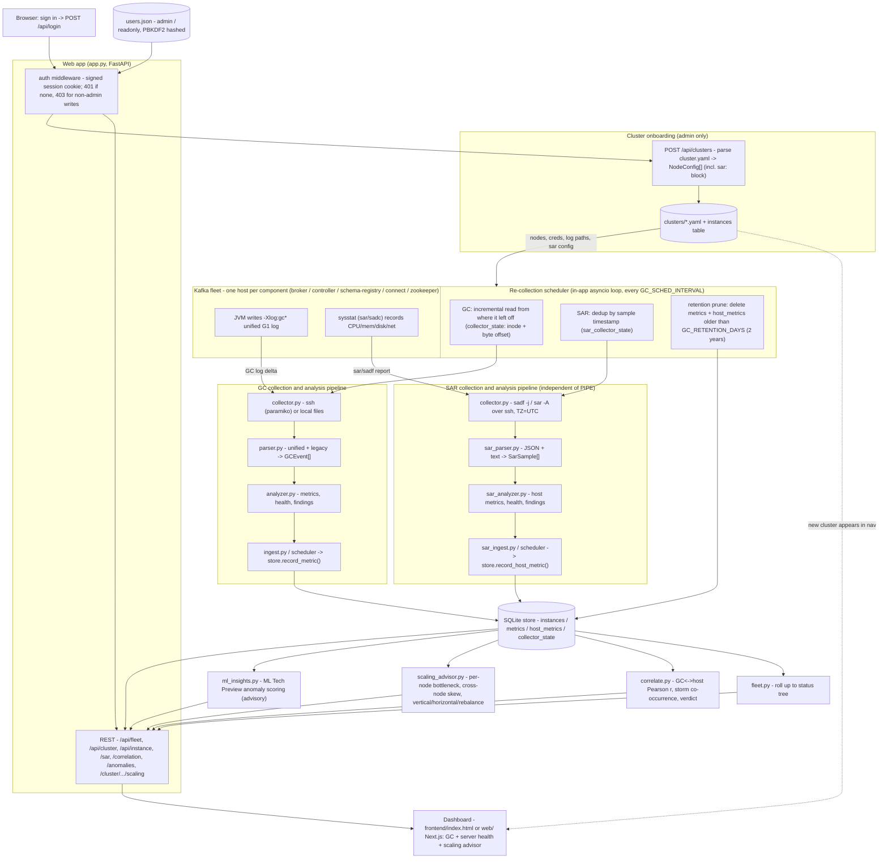

# BSP Kafka GC Analyzer

A self-hosted web app that analyzes JVM garbage-collection behavior across a
**multi-region Kafka fleet** and renders it as a navigable, color-coded
dashboard. It answers, at a glance: *what's healthy right now, what broke in the
last hour, and how has each component trended over the last month?*

It also pulls **OS-level server health (CPU, memory, disk, network) via SAR**
from every node over the same SSH connection used for GC logs, correlates it
against GC pressure, and recommends whether a Kafka cluster needs to scale
**vertically** (bigger boxes / more heap), **horizontally** (more brokers), or
just needs its **partitions/leaders rebalanced** across the brokers it already
has. See [Server health (SAR), GC correlation & scaling advisor](#server-health-sar-gc-correlation--scaling-advisor) below.

Navigation hierarchy:

```
Region (DEMO — extensible to NAM · EMEA · APAC in production)
  └─ Environment (KRAFT · ZOOKEEPER)
       └─ Cluster (DEMO-KRAFT or DEMO-ZK)
            └─ Component group (Brokers · Schema Registry · Kafka Connect ·
                               Controllers/KRaft *or* ZooKeeper)
                 └─ Instance (a single JVM, e.g. DEMO-KRAFT--broker-2)
```

Analysis depth is inspired by [gceasy.io](https://gceasy.io/) (throughput, pause
percentiles, Full-GC detection, heap occupancy, tuning advice) but runs
**entirely on your own infrastructure** — no logs leave your network, no API key.

---

## Running The App

Use `manage-app.sh` as the single control surface for local setup, deployment,
startup, shutdown, status, and logs:

```bash
./manage-app.sh deploy 8083        # setup .venv, install deps, seed if needed, restart app
./manage-app.sh start 8083 --open  # start in the background and open the dashboard
./manage-app.sh status 8083
./manage-app.sh logs 8083
./manage-app.sh restart 8083
./manage-app.sh stop 8083
```

Useful overrides:

```bash
GC_HOST=0.0.0.0 ./manage-app.sh start 8083
GC_DB=gc_live.db ./manage-app.sh deploy 8083
PYTHON=python3.14 ./manage-app.sh setup
```

The legacy `run.sh` and macOS `start-local.command` entrypoints are still
present, but they now delegate to `manage-app.sh`.

There are two interchangeable frontends over the **same FastAPI backend**:

1. **Next.js app** (`web/`) — the primary UI: a TypeScript App-Router app.
   Clicking the **BSP Kafka GC Analyzer** title returns to the fleet overview;
   clusters and instances are real routes (`/cluster/DEMO-KRAFT`,
   `/instance/DEMO-KRAFT--broker-2`).
2. **Single-file dashboard** (`frontend/index.html`) — the same dashboard with
   no build step; also used to produce the standalone `dashboard-preview.html`.

### Optional Manual Run — Backend + Next.js App

```bash
cd kafka-gc-analyzer
pip install -r requirements.txt
python -m seed.seed_history          # builds 30 days of demo GC history -> gc_history.db
python -m seed.seed_sar_history      # adds 30 days of correlated demo host metrics (CPU/mem/disk/net)
python -m gcanalyzer.app             # FastAPI backend on http://127.0.0.1:8000

# in a second terminal:
cd web
npm install
npm run build && npm start           # Next.js UI on http://127.0.0.1:3000
#   (dev mode: npm run dev)
```

The Next.js app proxies `/api/*` to the backend, so the browser stays
same-origin (no CORS). Point it elsewhere with `BACKEND_URL=http://host:8000`.

### Quick Start — No Build

```bash
./manage-app.sh start 8083 --open
```

Want to look without running anything? Open **`dashboard-preview.html`** — a
fully standalone snapshot of the demo fleet (20 JVMs, 2 clusters — KRaft + ZooKeeper,
30-day trends, live "last hour" alerts) inlined into one file. Regenerate with
`python export_static.py`.

---

## What the dashboard shows

**Left tree** — Region → Environment → Cluster → Component → Instance, each with
a status dot (🟢 healthy · 🟡 watch · 🔴 critical · ⚪ no data). Paths containing
problems auto-expand; a 🔴 marker flags any instance with a Full GC in the last
hour.

**Fleet overview (home)** — counts of healthy / watch / critical components and
a list of **"Issues in the last hour"**, color-coded by severity. Click any alert
to jump straight to the offending component.

**Cluster overview (click a cluster in the nav)** — one picture for a single
cluster (e.g. DEMO-KRAFT): how many nodes are healthy vs unhealthy, aggregate
cluster memory (live set vs total heap), and Java/GC configuration & telemetry
(GC engine, log format, pause target, avg throughput, Full GCs in the last
1h/24h, worst pause, heap sizing by role). Below that, every node as a
color-coded card, and a **"Needs attention"** section listing only the unhealthy
ones — click any of them to drill into that node and investigate.

**Instance view (click a broker / any component)**
- Current health grade (A–F) + score and the reasons behind it.
- Any active last-hour alerts.
- Current 24h metrics: throughput, time-in-GC, pause avg/p99/max, GC frequency,
  Full GCs, heap max, avg/peak live set, promotion trend.
- **30-day trend charts**: heap live set vs `-Xmx`, heap utilization %, GC pause
  trend (p99 & max), and Full GCs per day with time-in-GC overlay.
- Pros / Cons / How-to-improve — Kafka-aware tuning recommendations.
- **Server health (SAR)**: the same A–F treatment for the *host* underneath
  this JVM — CPU/iowait, memory/swap, disk, network — with its own trend
  charts and pros/cons/recommendations.
- **GC ↔ host correlation**: is this node's GC pressure a JVM tuning question
  or a host-resource one? Verdict, correlated signal pairs, and a "storm
  co-occurrence" read.

**Cluster view also shows a Capacity & scaling panel** — vertical /
horizontal / rebalance verdict with confidence, evidence, cross-node skew, and
a per-broker bottleneck table. See
[Server health (SAR), GC correlation & scaling advisor](#server-health-sar-gc-correlation--scaling-advisor)
for the full picture.

**Health grade legend** — A = healthy (`90-100`), B = good (`75-89`),
C = watch (`60-74`), D = at risk (`40-59`), and F = critical (`0-39`).
The score starts at `100` and subtracts risk points for low throughput, long
stop-the-world pauses, Full GCs, and high post-GC heap pressure. Host health
uses the same A–F scale, scored against CPU/iowait/memory/swap/disk/network
thresholds instead.

**ML Tech Preview** — anomaly scoring over the combined GC+host signal
(`gcanalyzer/ml_insights.py`): a dependency-free robust z-score baseline
always runs, and an `IsolationForest` (scikit-learn, optional) joins in
automatically when available for multivariate "unusual combination" detection.
Deterministic GC and host-resource rules remain the source of truth for health
grades and scaling verdicts — this only flags "worth a human look."

### "Last hour" alert triggers (color coding)

| Trigger | Severity | Default |
|---|---|---|
| Any Full GC | 🔴 critical | > 0 in last hour |
| Long stop-the-world pause | 🔴 critical | max pause > 500 ms |
| Heap pressure | 🟡 warning | post-GC live set > 85% |
| GC storm / throughput drop | 🟡 warning | time-in-GC > 3× the node's own 30-day baseline (min 5%) |

Thresholds live at the top of `gcanalyzer/store.py`.

---

## How it works with a real fleet

1. **Inventory** — `gcanalyzer/topology.py` defines regions, environments,
   clusters and component instances. Replace it with your real inventory (or
   load from config / service discovery).
2. **Collection** — `gcanalyzer/collector.py` pulls each node's GC log over SSH
   (paramiko) from the Kafka/ZooKeeper default log locations (override per node).
3. **Parse** — `gcanalyzer/parser.py` parses Java 11+ unified `-Xlog:gc*` G1 logs
   (and recognizes ZGC/Shenandoah/Parallel/CMS/Serial + legacy Java 8).
4. **Persist** — a periodic job calls `store.record_metric()` to append hourly
   rollups to SQLite (`gc_history.db`). That history is what powers 30-day trends
   and last-hour alerting. (`seed/seed_history.py` fakes this for the demo.)
5. **Collect host metrics** — independently, `gcanalyzer/sar_ingest.py` runs
   `sar`/`sadf` over the same SSH session and calls `store.record_host_metric()`
   on the same `instance_id` grid. (`seed/seed_sar_history.py` fakes this for
   the demo, correlated with the GC incidents above.)
6. **Correlate & recommend** — `correlate.py` and `scaling_advisor.py` read
   both tables back out on demand (no extra storage) to answer "is this
   GC-bound or host-bound" per instance and "vertical, horizontal, or
   rebalance" per cluster.
7. **Serve** — `gcanalyzer/app.py` (FastAPI) exposes the fleet rollup,
   per-instance GC + host snapshots, trends, correlation, and scaling
   recommendations; `frontend/index.html` (or the Next.js app in `web/`)
   renders the dashboard.

Enable GC logging on your nodes (Java 11+):

```
-Xlog:gc*:file=/opt/kafka/logs/kafkaServer-gc.log:time,uptime,level,tags:filecount=10,filesize=50M
```

And `sysstat` for host metrics — see
[Server health (SAR)](#server-health-sar-gc-correlation--scaling-advisor) above.

### REST API

| Method | Path | Returns |
|---|---|---|
| GET | `/api/fleet` | Topology tree with rollup health + last-hour alerts |
| GET | `/api/cluster/{cluster}` | One-cluster overview: counts, memory, config telemetry, nodes, attention list |
| GET | `/api/instance/{id}` | Current snapshot: health, alerts, metrics, findings |
| GET | `/api/instance/{id}/trends?days=30` | Daily-aggregated trend series |
| GET | `/api/instance/{id}/recent?hours=48` | Fine-grained recent series |
| GET | `/api/instance/{id}/series?range=24h` | Selectable-range GC trend series (`1h`..`2y`) |
| GET | `/api/instance/{id}/sar` | Current host (CPU/mem/disk/net) snapshot: health, findings |
| GET | `/api/instance/{id}/sar/trends?days=30` | Daily-aggregated host trend series |
| GET | `/api/instance/{id}/sar/series?range=24h` | Selectable-range host trend series |
| GET | `/api/instance/{id}/correlation?days=30` | GC&lt;-&gt;host correlation: verdict, r-values, findings |
| GET | `/api/instance/{id}/anomalies?days=30&recent_hours=24` | ML Tech Preview anomaly score (advisory) |
| GET | `/api/cluster/{cluster}/scaling?role=broker` | Vertical / horizontal / rebalance recommendation |
| GET | `/api/instance/{id}/forecast?days=90&horizon=90` | Capacity forecast: per-signal trend, days-to-breach, risk |
| GET | `/api/cluster/{cluster}/forecast?role=broker` | Proactive scaling plan: which direction, on what planning clock |
| POST | `/api/instance/{id}/sar/upload` | (admin) Ingest a pasted `sadf -j` / `sar -A` export — no SSH needed |
| GET | `/api/health` | Liveness probe |

---

## Server health (SAR), GC correlation & scaling advisor

Beyond parsing GC logs, the analyzer can SSH into the same Kafka/ZooKeeper
hosts and pull OS-level activity via **sysstat (`sar`/`sadf`)** — CPU, memory,
swap, disk, and network — then line it up against GC pressure to answer a
question GC logs alone can't: *is this node's GC problem actually a JVM
tuning problem, or is the host underneath it starved for resources?* And at
the cluster level: *should we scale vertically, horizontally, or just
rebalance partitions/leaders across the brokers we already have?*

### Prerequisite: sysstat

Each Kafka/ZooKeeper host needs the `sysstat` package installed and its
collection cron enabled (it usually is by default on most distros):

```bash
# Debian/Ubuntu
sudo apt-get install -y sysstat
sudo sed -i 's/^ENABLED="false"/ENABLED="true"/' /etc/default/sysstat   # if present
sudo systemctl enable --now sysstat

# RHEL/CentOS/Amazon Linux
sudo yum install -y sysstat
sudo systemctl enable --now sysstat
```

That's it — no agent to deploy. The analyzer reads `sar`/`sadf` output over
the *same* SSH session already used for GC logs; nothing is installed on the
analyzer side beyond the optional `paramiko` dependency it already needs.

### How collection works

1. **Collect** (`gcanalyzer/collector.py`) — over SSH, runs
   `TZ=UTC LC_ALL=C sadf -j -- -A` (structured JSON, sysstat >= 11.x) and
   falls back to `TZ=UTC LC_ALL=C sar -A` (the classic, extremely stable
   columnar text report every sysstat version can produce — the same format
   tools like [kSar](https://github.com/vlsi/ksar) parse) if `sadf -j` isn't
   available. `TZ=UTC` matters: sar/sadc store samples as UTC internally and
   render them in whatever TZ the *reporting* command runs under, so this
   makes every host's samples line up with GC metrics (also UTC epoch
   seconds) without needing to know each host's local timezone.
2. **Parse** (`gcanalyzer/sar_parser.py`) — both formats normalize into the
   same `SarSample` shape (CPU incl. steal, load 1/5/15, run queue, context
   switches, memory incl. available/page-cache/commit%, swap occupancy,
   paging activity from `sar -B` (pgpgin/pgpgout, faults, major faults),
   swapping activity from `sar -W` (pswpin/pswpout), per-disk, per-NIC —
   the full RHEL 8/9 sysstat section set), so the rest of the pipeline
   never needs to know which format the data came from.
3. **Analyze** (`gcanalyzer/sar_analyzer.py`) — rolls samples into the same
   "metrics / health / findings" shape `analyzer.py` produces for GC, so a
   node is judged the same way (A–F grade, pros/cons/recommendations)
   regardless of whether the numbers are JVM or OS metrics.
4. **Persist** (`store.py`'s `host_metrics` table) — same `instance_id` and
   time grid as the GC `metrics` table, so the two join trivially. Unlike GC
   log collection there's no byte offset to track: `sar`/`sadf` reports are
   re-queryable, not append-only files, so incremental collection just dedups
   by sample timestamp (`sar_collector_state` table).
5. **Correlate** (`gcanalyzer/correlate.py`) — joins GC and host metrics per
   instance, computes Pearson correlation between GC pressure signals
   (time-in-GC, pause tail, Full GC count) and host signals (CPU busy,
   iowait, memory, swap, disk await, NIC util), and a plain-language
   "storm co-occurrence" read (*of the hours this node was in a GC storm, what
   fraction also showed host pressure?*). Produces a `gc_bound` / `host_bound`
   / `mixed` verdict per instance.
6. **Recommend** (`gcanalyzer/scaling_advisor.py`) — at the cluster level,
   classifies each broker's dominant bottleneck (CPU / disk / iowait / host
   memory / swap / network / JVM heap / healthy) and measures cross-node skew
   (coefficient of variation on CPU busy and network egress, a throughput
   proxy). Uniform saturation across nodes -> **horizontal** (add brokers);
   one or two hot outliers while peers have room -> **rebalance** partitions
   /leaders first; JVM heap-bound with calm hosts -> **vertical** (more
   heap/RAM). Deterministic and explainable — every verdict ships with the
   evidence behind it, the same way GC findings do.
7. **ML Tech Preview** (`gcanalyzer/ml_insights.py`) — advisory-only anomaly
   scoring over the combined GC+host feature vector: a dependency-free robust
   z-score (median/MAD) baseline always runs; if `scikit-learn` is installed,
   an `IsolationForest` over the joined hourly feature vector also runs and
   can catch *combinations* that are unusual together even when no single
   metric crosses its own threshold. Like the rest of ML Tech Preview,
   deterministic rules (health grades, scaling verdicts) remain the source of
   truth — this only flags "worth a human look," never a diagnosis.

### Configuring it

Add a `sar:` block to your `cluster.yaml` (defaults shown — it's opt-out, not
opt-in):

```yaml
defaults:
  sar:
    enabled: true        # set false to skip a node/cluster entirely
    # source: ssh           # defaults to the node's own `source`
    # sar_bin: sar
    # sadf_bin: sadf
```

For offline/demo nodes (no live SSH target), point a node at a captured dump
instead — `samples/generate_sar_samples.py` shows the expected format:

```yaml
nodes:
  - id: broker-1
    sar:
      source: local
      local_path: ./samples/broker-1-sar.json   # sadf -j dump, or a `sar -A` text dump
```

The periodic scheduler (`gcanalyzer/scheduler.py`) collects SAR alongside GC
logs on every tick, independently — a host with SAR unreachable (or disabled)
never blocks GC log collection for that node, and vice versa. Onboarding a new
cluster from the dashboard runs an initial SAR collection pass the same way it
does for GC logs.

### What you get in the dashboard

- **Per-instance "Server health (SAR)"** panel: 24h CPU/iowait/memory/swap/
  disk/network summary, A–F resource-pressure grade, trend charts (network
  chart shows NIC util + egress **and ingress**), busiest disk/NIC tables,
  and pros/cons/recommendations.
- **Standalone "Host health analysis" view** (linked from every instance
  page; `/host/[id]` in the Next.js app): the *box* judged on its own with
  no GC data — every SAR metric the analyzer collects from RHEL 8/9 hosts,
  grouped as CPU & scheduler (user/system/iowait/steal, load 1/5/15, run
  queue, blocked, cswch/s, proc/s), memory/paging/swap (used, available,
  page cache, commit%, pgpgin/pgpgout, faults & major faults, pswpin/
  pswpout), and disk & network (util, await, tps, NIC util, ingress/
  egress) — each family charted over a selectable 1h–2y range, plus
  host-only findings and trend warnings from the capacity forecaster.
- **Per-instance "GC ↔ host correlation"** panel: verdict pill
  (gc-bound/host-bound/mixed), the strongest correlated signal pairs, the
  storm co-occurrence read, and the ML Tech Preview anomaly badge.
- **Per-cluster "Capacity & scaling"** panel: the vertical/horizontal/
  rebalance verdict with confidence, the evidence behind it, cross-node skew,
  and a per-broker bottleneck table.
- **Per-instance "Capacity outlook"** panel: Theil-Sen trend per GC/host
  signal with projected days-until-warning/critical breach and a
  low/medium/high confidence per signal.
- **Per-cluster "Capacity forecast"** panel: the proactive companion to the
  scaling advisor — a plan-horizontal / plan-vertical (RAM or heap) /
  tune-GC / watch-hot-node verdict, the earliest projected critical breach
  ("the planning clock"), and per-broker forecast warnings.
- **Per-instance "Upload SAR report"** panel (admin): paste or drop a
  `sadf -j -- -A` / `sar -A` export captured manually on the host — the
  no-SSH ingestion path (see below).

### Capacity forecasting (proactive scaling)

`gcanalyzer/forecast.py` turns the same daily GC + host history into "when
do we run out of headroom":

1. Each signal (CPU busy, iowait, memory, swap, disk util, NIC util, heap
   live set, time-in-GC) is aggregated to one point per day over a 90-day
   lookback.
2. A **Theil-Sen** trend (median pairwise slope) is fitted — one incident
   day cannot drag the slope, so the projection reflects sustained growth,
   not the worst day.
3. Days-until-breach is projected against the same warning/critical
   thresholds sar_analyzer/alerting already use, with an explicit
   confidence derived from history length and trend consistency.
4. At the cluster level, the breaching resource maps onto a proactive
   direction consistent with the scaling advisor: uniform CPU/disk/network
   growth -> *plan horizontal*; memory/swap growth -> *plan vertical (RAM)*;
   heap growth -> *plan vertical (heap)*; time-in-GC growth -> *tune GC
   first*; one node trending up while peers are flat -> *watch/rebalance
   the hot node* before buying hardware.

Like everything else here it is deterministic, explainable, and advisory —
every verdict ships with the evidence and dates behind it.

### SAR upload — the no-SSH path

Hosts you can't (or don't want to) reach over SSH from the analyzer can
still get full host-health/correlation/forecast coverage. On the RedHat
host run:

```bash
TZ=UTC LC_ALL=C sadf -j -- -A > broker1-sar.json    # preferred (JSON)
TZ=UTC LC_ALL=C sar -A > broker1-sar.txt            # classic text fallback
```

then paste/drop the output into the instance's **Upload SAR report** panel
(or `POST /api/instance/{id}/sar/upload`, admin role required). Uploads go
through the exact same parse -> analyze -> dedup-by-timestamp -> record
pipeline as SSH collection, so re-uploading the same report is always safe
and a daily copy/paste (or scripted `curl`) keeps trends accumulating.

---

## Architecture

```
gcanalyzer/
  topology.py        Region/env/cluster/component inventory model
  parser.py           Unified (Java 11+) + legacy GC log parser; collector detection
  analyzer.py         GC metrics, percentiles, health score, tuning recommendations
  collector.py        SSH (paramiko) + local-file GC-log AND SAR collection
  sar_parser.py       sadf JSON + classic `sar -A` text -> SarSample[]
  sar_analyzer.py     Host metrics, resource-pressure health score, findings
  correlate.py        GC <-> host correlation (Pearson r, storm co-occurrence, verdict)
  scaling_advisor.py  Cluster-level vertical/horizontal/rebalance recommendation
  forecast.py         Capacity forecasting: Theil-Sen trend per signal, days-to-breach,
                      proactive plan-horizontal/vertical/tune-GC cluster verdict
  ml_insights.py      ML Tech Preview: robust z-score + optional IsolationForest anomaly scoring
  store.py            SQLite time-series store; GC + host metrics; trends, alerts
  fleet.py            Rollup of inventory + history into the navigable status tree
  app.py              FastAPI: REST API + serves the dashboard
frontend/
  index.html    Single-page fleet dashboard (Chart.js from CDN) — GC + server health + scaling
web/            Next.js app (App Router, TypeScript) — primary UI over the API
  app/          routes: / (fleet), /cluster/[cluster], /instance/[id]
  components/   Header, Sidebar tree, Fleet/Cluster/Instance views, TrendCharts,
                HostMetricsPanel, SarTrendCharts, CorrelationPanel, ScalingAdvisorPanel
  lib/          api client, types, fleet context
  next.config.js   proxies /api/* to BACKEND_URL (default :8000)
seed/
  seed_history.py       30 days of synthetic GC demo history + injected incidents
  seed_sar_history.py   30 days of correlated synthetic host metrics (reads the same incidents)
  seed_forecast_demo.py rebuilds host history + overlays growth trends so the capacity
                        forecast demos plan_horizontal (DEMO-ZK) and watch_hot_node (DEMO-KRAFT)
samples/        Synthetic raw GC logs + generator; synthetic SAR text/JSON dumps + generator
tests/          test_pipeline.py · test_fleet.py · test_sar.py · test_correlation_scaling.py
export_static.py  Render a standalone, serverless dashboard snapshot
```

New files: live path — `gcanalyzer/ingest.py` (collect->parse->analyze->record_metric
bridge), `gcanalyzer/sar_ingest.py` (SAR companion bridge), `docker-compose.live.yml`,
`cluster.live.yaml`; auth — `gcanalyzer/auth.py`, `gcanalyzer/users.py`; re-collection —
`gcanalyzer/scheduler.py` (runs both bridges every tick, independently).

### Detailed data-flow architecture


```mermaid
flowchart TB
    subgraph SRC["Kafka fleet - one host per component (broker / controller / schema-registry / connect / zookeeper)"]
        JVM["JVM writes -Xlog:gc* unified G1 log"]
        SAR["sysstat (sar/sadc) records CPU/mem/disk/net"]
    end

    subgraph SCHED["Re-collection scheduler (in-app asyncio loop, every GC_SCHED_INTERVAL)"]
        INC["GC: incremental read from where it left off (collector_state: inode + byte offset)"]
        SARINC["SAR: dedup by sample timestamp (sar_collector_state)"]
        PRUNE["retention prune: delete metrics + host_metrics older than GC_RETENTION_DAYS (2 years)"]
    end

    subgraph PIPE["GC collection and analysis pipeline"]
        COL["collector.py - ssh (paramiko) or local files"]
        PAR["parser.py - unified + legacy -> GCEvent[]"]
        ANA["analyzer.py - metrics, health, findings"]
        REC["ingest.py / scheduler -> store.record_metric()"]
        COL --> PAR --> ANA --> REC
    end

    subgraph SARPIPE["SAR collection and analysis pipeline (independent of PIPE)"]
        SCOL["collector.py - sadf -j / sar -A over ssh, TZ=UTC"]
        SPAR["sar_parser.py - JSON + text -> SarSample[]"]
        SANA["sar_analyzer.py - host metrics, health, findings"]
        SREC["sar_ingest.py / scheduler -> store.record_host_metric()"]
        SCOL --> SPAR --> SANA --> SREC
    end

    subgraph ONB["Cluster onboarding (admin only)"]
        APIC["POST /api/clusters - parse cluster.yaml -> NodeConfig[] (incl. sar: block)"]
        CFG[("clusters/*.yaml + instances table")]
        APIC --> CFG
    end

    JVM -->|"GC log delta"| COL
    SAR -->|"sar/sadf report"| SCOL
    CFG -->|"nodes, creds, log paths, sar config"| SCHED
    INC --> COL
    SARINC --> SCOL
    REC --> DB[("SQLite store - instances / metrics / host_metrics / collector_state")]
    SREC --> DB
    PRUNE --> DB
    DB --> FL["fleet.py - roll up to status tree"]
    DB --> CORR["correlate.py - GC<->host Pearson r, storm co-occurrence, verdict"]
    DB --> SCALE["scaling_advisor.py - per-node bottleneck, cross-node skew, vertical/horizontal/rebalance"]
    DB --> ML["ml_insights.py - ML Tech Preview anomaly scoring (advisory)"]

    subgraph WEB["Web app (app.py, FastAPI)"]
        AUTH["auth middleware - signed session cookie; 401 if none, 403 for non-admin writes"]
        API["REST - /api/fleet, /api/cluster, /api/instance, /sar, /correlation, /anomalies, /cluster/.../scaling"]
        AUTH --> API
        AUTH --> APIC
    end

    FL --> API
    DB --> API
    CORR --> API
    SCALE --> API
    ML --> API
    USERS[("users.json - admin / readonly, PBKDF2 hashed")] --> AUTH
    LOGIN["Browser: sign in -> POST /api/login"] --> AUTH
    API --> DASH["Dashboard - frontend/index.html or web/ Next.js: GC + server health + scaling advisor"]
    CFG -.->|"new cluster appears in nav"| DASH
```

How the loop runs end to end:

- **Onboard** (admin): paste a `cluster.yaml` -> `POST /api/clusters` registers the
  nodes and persists `clusters/<cluster>.yaml`.
- **Collect** (scheduler, every interval): for each onboarded cluster, read each GC
  log *from its saved offset*, parse only the new events, `record_metric()` one
  point, then prune anything past the 2-year retention window.
- **Auth**: every `/api/*` needs a valid session cookie; `admin` adds/removes/modifies
  clusters, `readonly` can only view. Manage accounts with `python -m gcanalyzer.users`.
- **View**: the dashboard reads rollups + per-instance series from SQLite, with a
  selectable time range (1h, 3h, 6h, 12h, 24h, 2d, 7d, 30d, 90d, 1y, 2y).

---

## Tests

```bash
python -m tests.test_pipeline             # parsing + analysis (GC)
python -m tests.test_fleet                # inventory, trends, alerting, rollup
python -m tests.test_sar                  # SAR text/JSON parsing, host analyzer, store roundtrip
python -m tests.test_correlation_scaling  # correlate.py + scaling_advisor.py + ml_insights.py
python -m tests.test_forecast             # forecast.py + SAR upload ingest (no-SSH path)
```

The fleet tests seed a temp DB and confirm, among other things, that DEMO-KRAFT
carries all five environments, that an injected Full-GC storm raises a critical
last-hour alert while a 26-hour-old incident does **not**, and that a region rolls
up to `critical` when one component is failing.

The correlation/scaling tests build small synthetic instances/clusters and assert
each decision path independently: a periodic GC+CPU pressure pattern is flagged
`host_bound`, a heap-pressure pattern with a calm host is flagged `gc_bound`,
uniformly-saturated brokers verdict `horizontal`, one hot broker among calm peers
verdicts `rebalance`, and heap-bound brokers with headroom underneath verdict
`vertical_memory`.

---

## Notes & scope

- Tuned for **Java 11+ unified logging with G1** (the modern Kafka default).
- The demo fleet (20 JVMs, 2 clusters: KRaft + ZooKeeper) is generated for illustration; swap
  in your real inventory + a collection job to make trends accumulate from
  production.
- Read-only: it never restarts JVMs or changes flags. Recommendations are
  advisory — validate in a lower environment first. This applies doubly to the
  scaling advisor and ML Tech Preview: they identify where to look, not what
  to change; always validate in a lower environment.
- SAR collection needs `sysstat` installed and collecting on each host (see
  [Server health (SAR)](#server-health-sar-gc-correlation--scaling-advisor) above);
  a node without it simply shows no host-health data, GC analysis is unaffected.
- The IsolationForest anomaly model (`scikit-learn`, optional) only activates
  with enough overlapping GC+host history; otherwise the dependency-free
  robust z-score method is used automatically — no configuration needed.
- SQLite is used for the history store; for a large fleet with long retention you
  can point `store` at Postgres/Timescale with minimal changes (the query layer
  is small and isolated). This now includes the `host_metrics` table alongside
  `metrics`.
```
